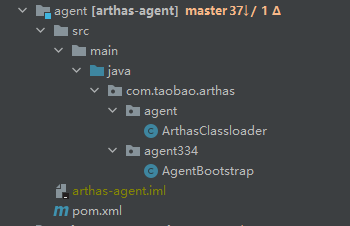

# 启航

## 关于arthas

​		arthas应该是java开发者最常用的开发诊断工具之一了。基本整合了对java应用所有维度的检查手段。就我个人而言，这玩意可比java自带的工具命令好使多了，详细情况的话，大家请自行前往官网查看。

​		[arthas官方文档](https://arthas.aliyun.com/doc/en/)

​		[arthas源码地址](https://github.com/alibaba/arthas)

## 本次要探讨的内容

### 梦开始的地方-Attach

​		arthas的基本运作原理就是将arthas的jar包加载到目标java进程来运行，要完成这一步，就需要通过attach功能来实现。

#### 1.Attach是什么

​		attach机制是jvm提供的jvm进程间通信的手段，在java程序中，我们可以通过attach机制关联到另一个jvm进程，并通过该机制对另一个进程进行一定的操作，如执行内部命令dumpheap,threaddump等获取堆信息和线程信息。也可以动态的为另一个进程加载jar包。在arthas中，就是使用VirtualMachine提供的loadAgent方法将arthas的agent包加载到目标进程。相关代码如下:

**com/taobao/arthas/core/Arthas.java**

```java
VirtualMachine virtualMachine = null;
try {
    if (null == virtualMachineDescriptor) { // 使用 attach(String pid) 这种方式
        virtualMachine = VirtualMachine.attach("" + configure.getJavaPid());
    } else {
        virtualMachine = VirtualMachine.attach(virtualMachineDescriptor);
    }
    
	//bulabulabula...
	
    String arthasAgentPath = configure.getArthasAgent();
    //convert jar path to unicode string
    configure.setArthasAgent(encodeArg(arthasAgentPath));
    configure.setArthasCore(encodeArg(configure.getArthasCore()));
    try {
        virtualMachine.loadAgent(arthasAgentPath,
                configure.getArthasCore() + ";" + configure.toString());
    } catch (IOException e) {
        //bulabulabula...
    }
} finally {
    if (null != virtualMachine) {
        virtualMachine.detach();
    }
}
```

在上面的代码中，可以看到attach方法返回了一个VirtualMachine对象，这个对象封装了一系列操作/获取目标进程信息的方法，大致列表如下

**sun/tools/attach/HotSpotVirtualMachine.class**


这些方法最终都会映射成一个个命令，命令列表如下（这些命令我也就不一一解释了，大家看名字应该能大致了解这些命令都有啥作用，感兴趣的话可以自行查阅源码）：

**hotspot/src/share/vm/services/attachListener.cpp**

```c++
static AttachOperationFunctionInfo funcs[] = {
  { "agentProperties",  get_agent_properties },
  { "datadump",         data_dump },
  { "dumpheap",         dump_heap },
  { "load",             JvmtiExport::load_agent_library },
  { "properties",       get_system_properties },
  { "threaddump",       thread_dump },
  { "inspectheap",      heap_inspection },
  { "setflag",          set_flag },
  { "printflag",        print_flag },
  { "jcmd",             jcmd },
  { NULL,               NULL }
};
```

（ps：关于Attach如何在jvm中实现，这里有一篇文章讲的很细致，大家可以参阅下[JVM源码分析之Attach机制实现完全解读](https://mp.weixin.qq.com/s?__biz=MzIzNjI1ODc2OA==&mid=2650886799&idx=1&sn=108c5fdfcd2695594d4f80ff02fc9a70&mpshare=1&scene=21&srcid=0114WsKpUmDXhRtqy8x7JX5w#wechat_redirect)）

#### 2.instrument实现agent部署

在介绍下面的内容前,大家可以先看看这个[文档](https://docs.oracle.com/javase/10/docs/api/java/lang/instrument/package-summary.html)对instrument在虚拟机中的运作机制稍作了解

前文讲到，Attach通过loadAgent讲agent包加载到了指定进程，如下

```java
virtualMachine.loadAgent(arthasAgentPath,
                configure.getArthasCore() + ";" + configure.toString());
```

加载的jar包就是下面这个项目生成的jar包



看pom中指定的premain和agentmain如下


在loadAgent讲agent加载到指定进程后，会自动执行agentmain方法，主要逻辑就是通过参数来创建一个能够加载到arthas-core包的ClassLoader，最后会通过加载**com/taobao/arthas/core/server/ArthasBootstrap.java**并执行获取ArthasBootstrap单例对象的方法getInstance（），自此，arthas初期执行就算完成了，代码大略如下（有删减）

```java
private static synchronized void main(String args, final Instrumentation inst) {
        // 尝试判断arthas是否已在运行，如果是的话，直接就退出
        try {
            Class.forName("java.arthas.SpyAPI"); // 加载不到会抛异常
            if (SpyAPI.isInited()) {
                return;
            }
        } catch (Throwable e) {
        }
        try {
            // 传递的args参数分两个部分:arthasCoreJar路径和agentArgs, 分别是Agent的JAR包路径和期望传递到服务端的参数
            if (args == null) {
                args = "";
            }
            args = decodeArg(args);

            String arthasCoreJar;
            final String agentArgs;
            int index = args.indexOf(';');
            if (index != -1) {
                arthasCoreJar = args.substring(0, index);
                agentArgs = args.substring(index);
            } else {
                arthasCoreJar = "";
                agentArgs = args;
            }

            File arthasCoreJarFile = new File(arthasCoreJar);
            if (!arthasCoreJarFile.exists()) {
                // try to find from arthas-agent.jar directory
                CodeSource codeSource = AgentBootstrap.class.getProtectionDomain().getCodeSource();
                if (codeSource != null) {
                    File arthasAgentJarFile = new File(codeSource.getLocation().toURI().getSchemeSpecificPart());
                    arthasCoreJarFile = new File(arthasAgentJarFile.getParentFile(), ARTHAS_CORE_JAR);
                }
            }
            if (!arthasCoreJarFile.exists()) {
                return;
            }
            /**
             * Use a dedicated thread to run the binding logic to prevent possible memory leak. #195
             */
            final ClassLoader agentLoader = getClassLoader(inst, arthasCoreJarFile);

            Thread bindingThread = new Thread() {
                @Override
                public void run() {
                    try {
                        bind(inst, agentLoader, agentArgs);
                    } catch (Throwable throwable) {
                        throwable.printStackTrace(ps);
                    }
                }
            };

            bindingThread.setName("arthas-binding-thread");
            bindingThread.start();
            bindingThread.join();
        } catch (Throwable t) {
            t.printStackTrace(ps);
            try {
                if (ps != System.err) {
                    ps.close();
                }
            } catch (Throwable tt) {
                // ignore
            }
            throw new RuntimeException(t);
        }
    }
```

bind方法细节

```java
private static void bind(Instrumentation inst, ClassLoader agentLoader, String args) throws Throwable {
        /**
         * <pre>
         * ArthasBootstrap bootstrap = ArthasBootstrap.getInstance(inst);
         * </pre>
         */
        Class<?> bootstrapClass = agentLoader.loadClass(ARTHAS_BOOTSTRAP);
        Object bootstrap = bootstrapClass.getMethod(GET_INSTANCE, Instrumentation.class, String.class).invoke(null, inst, args);
        boolean isBind = (Boolean) bootstrapClass.getMethod(IS_BIND).invoke(bootstrap);
        if (!isBind) {
            String errorMsg = "Arthas server port binding failed! Please check $HOME/logs/arthas/arthas.log for more details.";
            ps.println(errorMsg);
            throw new RuntimeException(errorMsg);
        }
        ps.println("Arthas server already bind.");
    }
```

