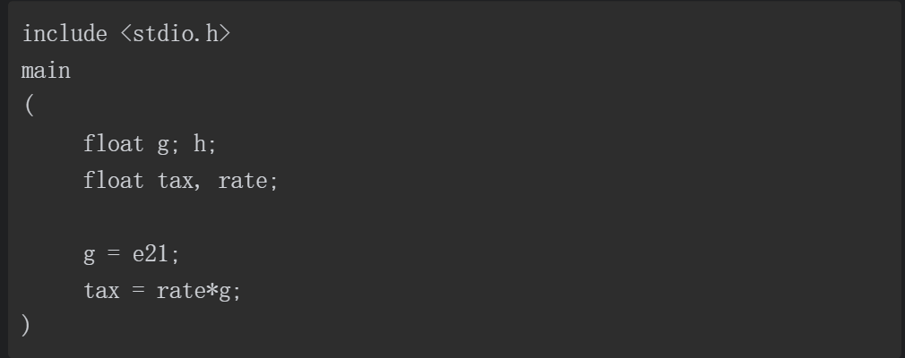
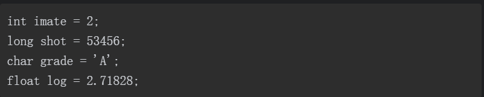
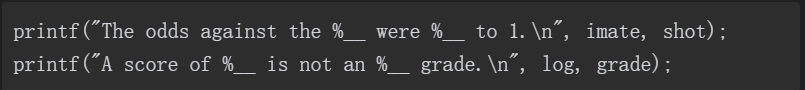
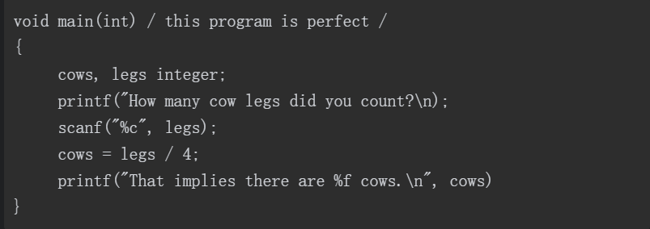
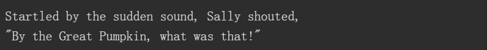
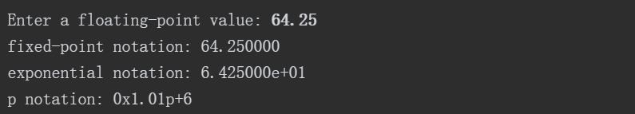

# 复习题

### 1．指出下面各种数据使用的合适数据类型（有些可使用多种数据类型）：　　

a．East Simpleton的人口     -> int (歧视吗?)

b．DVD影碟的价格　->  float (考虑到有零有整)

c．本章出现次数最多的字母　-> char

d．本章出现次数最多的字母次数 -> short

### 2．在什么情况下要用long类型的变量代替int类型的变量？

当数值范围超过int所能表达的最大值时

### 3．使用哪些可移植的数据类型可以获得32位有符号整数？选择的理由是什么？

int32_t:可以保证移植前后数据位数保持32位不变

int_least32_t:可以保证移植前后数据位数至少32位

### 4．指出下列常量的类型和含义（如果有的话）：

a．'\b'　　——》char

b．1066　　——》int

c．99.44　　——》float

d．0XAA　　——》int类型16进制写法

e．2.0e30	——》double

### 5．Dottie Cawm编写了一个程序，请找出程序中的错误。



1.函数没有声明返回值类型

2.声明变量应该用逗号分隔

3.rate变量没有赋值就直接应用

4.g的赋值错误，浮点数不能只有指数部分（浮点数结构：有符号的数字【包含小数点】+e/E+有符号的整数【正整数符号也可以省略】，其中，可以没有小数点或者指数部分，但是不能同时省略两者，也可以省略小数点后部分或者小数点前整数部分，但不能同时省略两者）

5.函数没有返回值

### 6．写出下列常量在声明中使用的数据类型和在printf()中对应的转换说明：

| 常量      | 类型   | 转换说明（%转换字符） |
| --------- | ------ | --------------------- |
| 12        | int    | %d                    |
| 0x3       | int    | %#x                   |
| 'c'       | char   | %c                    |
| 2.34E07   | double | %e                    |
| '\040'    | char   | %#o                   |
| 7.0       | double | %f                    |
| 6L        | long   | %ld                   |
| 6.0f      | float  | %f                    |
| 0.5.b6p12 | double | %a                    |

### 7．写出下列常量在声明中使用的数据类型和在printf()中对应的转换说明（假设int为16位）：

| 常量    | 类型        | 转换说明（%转换字符） |
| ------- | ----------- | --------------------- |
| 012     | int         | %#o                   |
| 2.9e05L | long double | %lf                   |
| 's'     | char        | %c                    |
| 100000  | long        | %ld                   |
| '\n'    | char        | %c                    |
| 20.0f   | float       | %f                    |
| 0x44    | int         | %#x                   |
| -40     | int         | %d                    |

### 8．假设程序的开头有下列声明：



把下面printf()语句中的转换字符补充完整：、



printf("the odds against the %d were %ld to 1. \n", image, shot);

printf("A score of %c is not an %f grade. \n", log, grade);

### 9．假设ch是char类型的变量。分别使用转义序列、十进制值、八进制字符常量和十六进制字符常量把回车字符赋给ch（假设使用ASCII编码值）。

char c = 'A';  //字符

c = 65;  //十进制

c = '\n';  //转义序列

c = '\007'  | '\07' | '\7'； //八进制

c = '\x10' | '\x010';   //十六进制

### 10．修正下面的程序（在C中，/表示除以）。



```c
int main () /* this program is perfect */

{

  float cows;

  int legs;

  printf("how many cow legs did you count? \n");

  scanf("%d", &legs);

  cows = legs/4.0;

  printf("That implies there are %f cows.\n", cows);

  return 0;

}
```


### 11．指出下列转义序列的含义：　　

a．\n　　换行

b．\\\　　注释

c．\\"　　普通双引号，可以放在字符串内容之中

d．\t		横向制表符

# 编程练习

### 1．通过试验（即编写带有此类问题的程序）观察系统如何处理整数上溢、浮点数上溢和浮点数下溢的情况。

```c
int main () 

{
  int num = -2147483649;

  /* 

  int溢出的处理方式在本机为重新从int最小值开始计数来处理上溢出的数值,下溢出的数值刚好相反

  会从最大值开始往最小值方向递减来处理下溢出的数值

  */

  printf("int num : %d\n", num); 

  /*

  从结果来看，浮点数上溢会导致出现1.#INF00数值，表示无穷大

  而浮点数下溢出则会将值置为0

  */

  float f_up = 10E40;

  printf("float num1 : %f\n", f_up);

  float f_down = 10E-50;

  printf("float num1 : %.60f\n", f_down);

  return 0;

}
```

### 2．编写一个程序，要求提示输入一个ASCII码值（如，66），然后打印输入的字符。

```c
int main () 

{

  char c;

  printf("please input ASCII num.\n");

  scanf("%d",&c);

  printf("input char is %c", c);

  return 0;

}
```

### 3．编写一个程序，发出一声警报，然后打印下面的文本：



```c
int main () 

{

  char c = '\a';

  printf("%c", c);

  getchar();  //语句就不打印了，蜂鸣发出来了

  return 0;

}
```

### 4．编写一个程序，读取一个浮点数，先打印成小数点形式，再打印成指数形式。然后，如果系统支持，再打印成p记数法（即十六进制记数法）。按以下格式输出（实际显示的指数位数因系统而异）：



```c
int main () 

{

  float num = 64.25f;

  printf("float value : %0.2f\n", num);

  printf("fixed point value : %f\n", num);

  printf("enponential value : %e\n", num);

  printf("p value : %a\n", num);

  return 0;

}
```

### 5．一年大约有3.156×10^7秒。编写一个程序，提示用户输入年龄，然后显示该年龄对应的秒数。

```c
int main () 

{

  float seconds = 3.156E7;

  int year;


  printf("请输入年龄：\n");

  scanf("%d", &year);

  printf("已经活了%f秒",seconds*year);


  return 0;

}
```

### 6．1个水分子的质量约为3.0×10−23克。1夸脱水大约是950克。编写一个程序，提示用户输入水的夸脱数，并显示水分子的数量。

```c
int main () 

{

  float numberator = 3E-23;

  int water = 950;

  int num;


  printf("请输入夸脱数：\n");

  scanf("%d", &num);

  float total = (num*water)/numberator;

  printf("包含%f个分子", total);


  return 0;

}
```

### 7．1英寸相当于2.54厘米。编写一个程序，提示用户输入身高（/英寸），然后以厘米为单位显示身高。

```c
int main () 

{

  int inch;

  float rate = 2.54;
  

  printf("请输入身高（单位：英寸）：\n");

  scanf("%d", &inch);

  float total = rate*inch;

  printf("身高为%0.2fcm", total);


  return 0;

}
```

### 8．在美国的体积测量系统中，1品脱等于2杯，1杯等于8盎司，1盎司等于2大汤勺，1大汤勺等于3茶勺。编写一个程序，提示用户输入杯数，并以品脱、盎司、汤勺、茶勺为单位显示等价容量。思考对于该程序，为何使用浮点类型比整数类型更合适？

```c
int main () 

{

  float pint,cups,ounce,ladle,tsp;
  

  printf("请输入品脱数量：\n");

  scanf("%f", &pint);


  cups = pint * 2;

  printf("相当于%0.2f杯\n", cups);


  ounce = cups * 8;

  printf("相当于%0.2f盎司\n",ounce);


  ladle = ounce * 2;

  printf("相当于%0.2f汤勺\n",ladle);


  tsp = ladle * 3;

  printf("相当于%0.2f茶勺\n",tsp);
  

  return 0;

}
```

关于改程序为何使用浮点数比使用int值更加适合，目前惟一的猜想就是品脱转化到汤勺的比例为1:96，有些机器上int值只有两个字节，输入数值过大容易造成溢出，而float就不太容易溢出。
