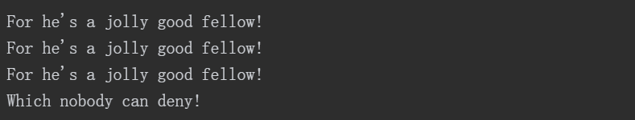

# 复习题

### 1.C语言的基本模块是什么？

函数

### 2.什么是语法错误？写出一个英语例子和C语言例子。

没有遵循C语言规则的语句就是语法错误。

eg:

```c
int a,int b,int c;
```

### 3.什么是语义错误？写出一个英语例子和C语言例子。

遵循了C语言规范的程序，但最终结果错误，为语义错误

eg:

```c
int n, nCube;
n = 4;
nCube = n * n;
```

### 4.Indiana Sloth编写了下面的程序，并征求你的意见。请帮助他评定。


*include前没有使用#*

*stduio.h头文件拼写错误，应为stdio.h,且头文件需要<>扩起来*

*函数的参数列表应该用（）包裹*

*函数主体应该用{}包裹*

*注释格式应该为  /*  注释 */*

*语句结尾应该加 ;*

*赋值符号应该是 = 而不是 :=*

*字符串应该用 “内容” 包裹*

*要在字符串插入字符需要用占位符，且函数应为printf()*

**修改后正确程序如下：**

```c
#include <stdio.h>

int main (void) /* 该程序打印一年有多少周 */
{
    int s;
    s = 56;
    
    printf("There are %d weeks in a year.",s);
    return 0;
}
```

### 5.假设下面的4个例子都是完整程序中的一部分，它们都输出什么结果？


输出结果如下:


### 6.在main、int、function、char、=中，哪些是C语言的关键字？


参考上图，关键字为 int和char（function和main竟然不是关键字）

### 7．如何以下面的格式输出变量words和lines的值（这里，3020和350代表两个变量的值）？

```c
int words, lines;
words = 3020;
lines = 350;

printf("There were %d words and %d lines",words,lines);
```

### 8．考虑下面的程序：请问，在执行完第7、第8、第9行后，程序的状态分别是什么？


第七行：a=5,b=2;

第八行：a=5,b=5;

第九行：a=5,b=5;

### 9．考虑下面的程序：请问，在执行完第7、第8、第9行后，程序的状态分别是什么？


第七行：x=10,y=5;

第八行：x=10,y=15;

第九行：x=150,y=15;


# 编程练习

### 1．编写一个程序，调用一次printf()函数，把你的名和姓打印在一行。再调用一次printf()函数，把你的名和姓分别打印在两行。然后，再调用两次printf()函数，把你的名和姓打印在一行。

```c
#include <stdio.h>

int main (void) 
{
    printf("no name\n");
    printf("no\nname\n");
    printf("no ");
    printf("name\n");

    return 0;
}
```

### 2.编写一个程序，打印你的姓名和地址。

```c
#include <stdio.h>

int main (void) 
{
    printf("no name\nand no address");

    return 0;
}
```

### 3．编写一个程序把你的年龄转换成天数，并显示这两个值。这里不用考虑闰年的问题。

```c
#include <stdio.h>

int main (void) 
{
    int age = 24;
    int days_in_year = 365;
    printf("我已经活了%d天",age * days_in_year);

    return 0;
}
```

这里遇到了一个问题，那就是终端输出中文乱码，简单的一个解决方案就是在终端执行命令，可以切换到utf8编码

```
chcp 65001
```

### 4．编写一个程序，生成以下输出：除了main()函数以外，该程序还要调用两个自定义函数：一个名为jolly()，用于打印前3条消息，调用一次打印一条；另一个函数名为deny()，打印最后一条消息。



```c
#include <stdio.h>

void jolly();
void deny();

int main () 
{
    jolly();
    jolly();
    jolly();
    deny();
    
    return 0;
}

void jolly() 
{
    printf("For he's a jolly good fellow!\n");
}

void deny()
{
    printf("Which nobody can deny!");
}
```

### 5．编写一个程序，生成以下输出：除了main()以外，该程序还要调用两个自定义函数：一个名为br()，调用一次打印一次“Brazil, Russia”；另一个名为ic()，调用一次打印一次“India, China”。其他内容在main()函数中完成。


```c
#include <stdio.h>

void br();
void ic();

int main () 
{
    br();
    printf(",");
    ic();
    printf("\n");
    br();
    printf("\n");
    ic();
    
    return 0;
}

void br() 
{
    printf("Brazil, Russia");
}

void ic()
{
    printf("India, China");
}
```

### 6．编写一个程序，创建一个整型变量toes，并将toes设置为10。程序中还要计算toes的两倍和toes的平方。该程序应打印3个值，并分别描述以示区分。

```c
#include <stdio.h>

int main () 
{
    int toes = 10;
    int toes2 = toes * toes;
    int toes3 = toes2 * toes;

    printf("toes: %d\ntoes平方:%d\ntoes立方:%d",toes,toes2,toes3);

    return 0;
}
```

### 7．许多研究表明，微笑益处多多。编写一个程序，生成以下格式的输出：该程序要定义一个函数，该函数被调用一次打印一次“Smile!”，根据程序的需要使用该函数。


```c
#include <stdio.h>

void smile();

int main () 
{
    smile();
    smile();
    smile();
    printf("\n");

    smile();
    smile();
    printf("\n");

    smile();
    
    return 0;
}

void smile()
{
    printf("smile!");
}
```

### 8．在C语言中，函数可以调用另一个函数。编写一个程序，调用一个名为one_three()的函数。该函数在一行打印单词“one”，再调用第2个函数two()，然后在另一行打印单词“three”。two()函数在一行显示单词“two”。main()函数在调用one_three()函数前要打印短语“starting now:”，并在调用完毕后显示短语“done!”。因此，该程序的输出应如下所示：


```c
#include <stdio.h>

void one_three();
void two();

int main () 
{
    printf("starting now:\n");
    one_three();
    printf("done!\n");

    return 0;
}

void one_three()
{
    printf("one\n");
    two();
    printf("three\n");

}

void two()
{
    printf("two\n");
}
```

