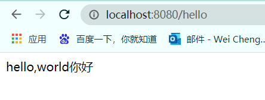

# 目标

搭建一个简单的springboot项目，访问/hello请求可相应对应的界面

# 流程

### 1.构建一个maven项目（略）

### 2.pom.xml文件构建

在新建的pom.xml文件中，添加如下parent

```xml
<parent>
    <groupId>org.springframework.boot</groupId>
    <artifactId>spring-boot-starter-parent</artifactId>
    <version>2.6.3</version>
</parent>
```

------

*Note:这个parent中定义了很多对应sprintboot版本的默认依赖配置，可以很方便的引入starter以及普通jar包依赖而无需指定版本，parent会自动引入默认配置的依赖版本。如果有需要引入不同的依赖版本，可以参考下一篇的依赖管理章节。*


开发web项目还需要引入如下starter

```xml
<dependencies>
    <dependency>
        <groupId>org.springframework.boot</groupId>
        <artifactId>spring-boot-starter-web</artifactId>
    </dependency>
</dependencies>
```


### 3.创建主程序类

**com.example.boot.MainApplication**

```java
@SpringBootApplication
public class MainApplication {

    public static void main(String[] args) {
        SpringApplication.run(MainApplication.class);
    }
}
```


### 4.创建controller

**com.example.boot.controller.HelloController**

```java
@RestController  // == @ResponseBody + @Controller
public class HelloController {

    @RequestMapping("/hello")
    public String handle01() {
        return "hello,world" + "你好";
    }
}
```


### 5.运行与访问

直接运行MainApplication的main方法

访问 http://localhost:8080/hello

访问结果



# 扩展

### 1.springboot的各项配置

https://docs.spring.io/spring-boot/docs/current/reference/html/application-properties.html#application-properties

### 2.关于打包

pom.xml添加如下插件配置，在pom.xml文件所在目录使用mvn clean package命令打包，使用java -jar xxx.jar 命令即可使用

```xml
<build>
    <plugins>
        <plugin>
            <groupId>org.springframework.boot</groupId>
            <artifactId>spring-boot-maven-plugin</artifactId>
        </plugin>
    </plugins>
</build>
```

