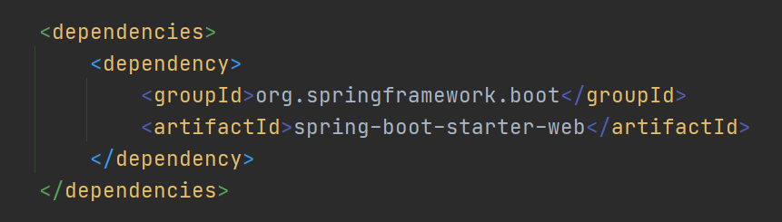
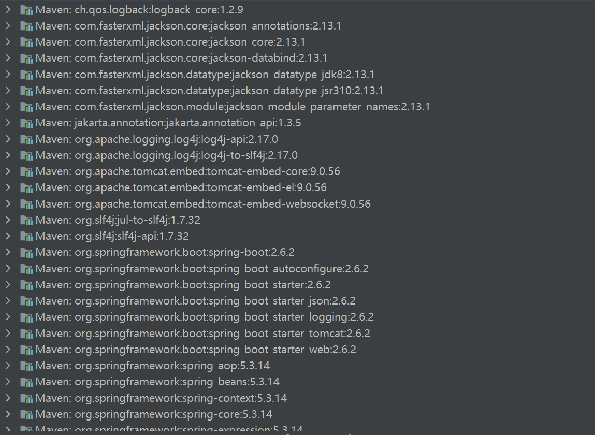
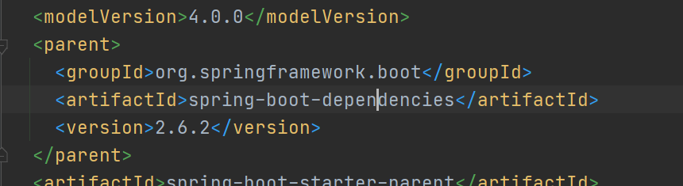
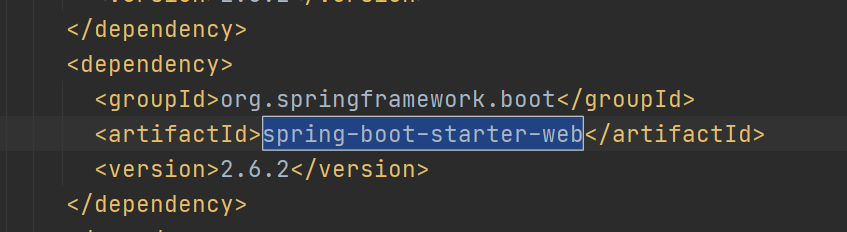
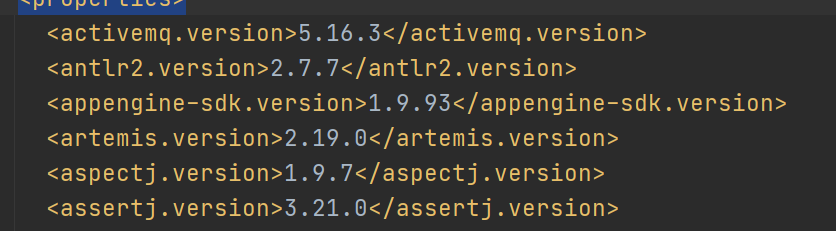
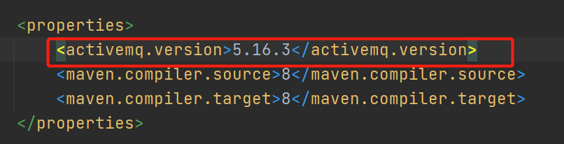

# 目标

了解springboot的依赖管理和自动配置的特性

# 依赖管理

如果仔细观察pom.xml文件配置，就会发现引入starter时不需要指定version。而且会自动导入合理的依赖包版本。如下配置了web starter后，自动引入了spring构建web项目所需要的所有jar包






*Note : https://docs.spring.io/spring-boot/docs/current/reference/html/using.html#using.build-systems.starters 各类starters*


依赖管理所能实现的的关键就在于引入了spring-boot-starter-parent,在spring-boot-starter-parent中可以看到，它的parent指向了spring-boot-dependencies，这个pom文件中配置了各种当前springboot版本所指定的常见jar包及其版本




打开spring-boot-dependencies，可以看到在这个文件的<dependencyManagement>元素中，配置了如下信息。




*Note : parent文件的dependencyManagement元素中配置dependency后，在子文件中无需指定版本，只需说明groupId和artifactId*


spring-boot-dependencies的<properties>元素也声明了各个常用jar包的版本，如下




如果要在自己的项目中更改某个依赖jar包的版本，只需要在自己的pom.xml文件中声明同名的属性变量名即可

eg: 这里就指定了activemq的版本为5.16.3



当然，也可以使用平常配置maven依赖的方法添加jar包详细的dependency信息，重新指定版本覆盖掉默认配置。不过不太建议。

# 自动配置

### 1.自动配置依赖

引入spring-boot-starter-web时，会自动引入构建web所需的所有jar包，就是因为spring-boot-starter-web相关的pom.xml配置了这些jar包的依赖(springMVC组件，tomcat，json字符串处理等)，如下：

```xml
<dependencies>
    <dependency>
      <groupId>org.springframework.boot</groupId>
      <artifactId>spring-boot-starter</artifactId>
      <version>2.6.2</version>
      <scope>compile</scope>
    </dependency>
    <dependency>
      <groupId>org.springframework.boot</groupId>
      <artifactId>spring-boot-starter-json</artifactId>
      <version>2.6.2</version>
      <scope>compile</scope>
    </dependency>
    <dependency>
      <groupId>org.springframework.boot</groupId>
      <artifactId>spring-boot-starter-tomcat</artifactId>
      <version>2.6.2</version>
      <scope>compile</scope>
    </dependency>
    <dependency>
      <groupId>org.springframework</groupId>
      <artifactId>spring-web</artifactId>
      <version>5.3.14</version>
      <scope>compile</scope>
    </dependency>
    <dependency>
      <groupId>org.springframework</groupId>
      <artifactId>spring-webmvc</artifactId>
      <version>5.3.14</version>
      <scope>compile</scope>
    </dependency>
  </dependencies>
```


### 2.自动扫描组件

springboot还省略了包扫描配置，主要原因是会将主程序类所在目录作为根目录来扫码这个目录下的所有包。官方文档描述如下

```
We generally recommend that you locate your main application class in a root package above other classes. The @SpringBootApplication annotation is often placed on your main class, and it implicitly defines a base “search package” for certain items. For example, if you are writing a JPA application, the package of the @SpringBootApplication annotated class is used to search for @Entity items. Using a root package also allows component scan to apply only on your project.
```

另外，如果想指定扫描的根目录，可以使用 @SpringBootApplication(scanBasePackages="包路径")


### 3.约定优于配置

很多配置都有默认值，后续如果要针对这些配置指定值，都可以参考配置文档来赋值

- 默认配置最终都是映射到MultipartProperties
- 配置文件的值最终会绑定到某个类上，这个类会在容器中创建对象


### 4.按需加载默认配置

- 引入什么场景，场景相关的自动配置才会开启
- springboot所有的自动配置都在Spring-boot-autoconfigure包里面（TODO 后续学习）


