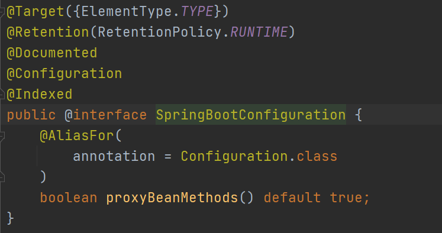
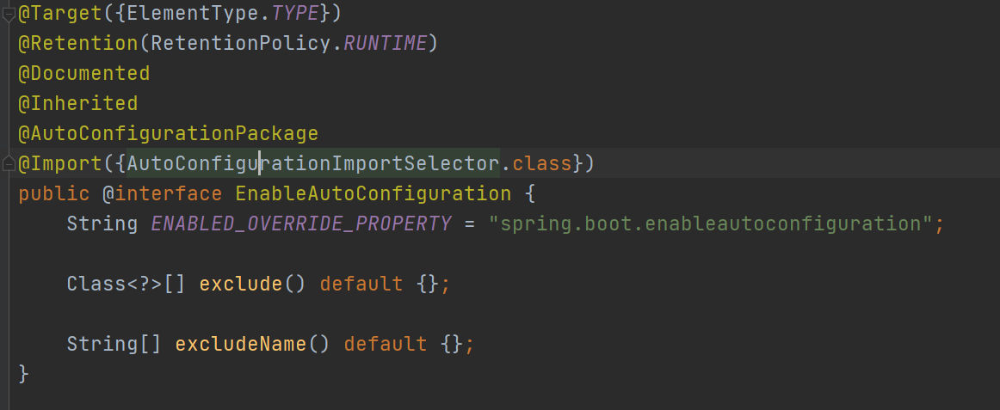
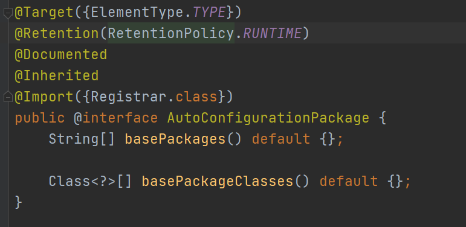

# 自动配置

## @SpringBootApplication

@SpringBootApplication 注解包含主要内容如下

```java
@SpringBootConfiguration
@EnableAutoConfiguration
@ComponentScan(
    excludeFilters = {@Filter(
    type = FilterType.CUSTOM,
    classes = {TypeExcludeFilter.class}
), @Filter(
    type = FilterType.CUSTOM,
    classes = {AutoConfigurationExcludeFilter.class}
)}
)
```

### @SpringBootConfiguration



代表当前是一个配置类

### @ComponentScan

指定扫描包

### @EnableAutoConfiguration



#### @AutoConfigurationPackage （自动配置包）

@Import 高级用法： https://www.bilibili.com/video/BV1gW411W7wy?p=8

给容器中导入Main方法所在包下的所有组件（这个是否会和@ComponentScan冲突？）



```java
static class Registrar implements ImportBeanDefinitionRegistrar, DeterminableImports {
    Registrar() {
    }

    //利用register给容器中导入一系列组件，批量注册Main所在包下所有组件，可以debug查看
    public void registerBeanDefinitions(AnnotationMetadata metadata, BeanDefinitionRegistry registry) {
        AutoConfigurationPackages.register(registry, (String[])(new AutoConfigurationPackages.PackageImports(metadata)).getPackageNames().toArray(new String[0]));
    }

    public Set<Object> determineImports(AnnotationMetadata metadata) {
        return Collections.singleton(new AutoConfigurationPackages.PackageImports(metadata));
    }
}
```

利用Register给应用中批量注册一系列组件

将指定包下的所有组件导入注册（可以debug查看）

#### @Import({AutoConfigurationImportSelector.class})

1. 利用 getAutoConfigurationEntry(AnnotationMetadata annotationMetadata)； 给容器中批量导入一些组件

2. 调用 List<String> configurations = this.getCandidateConfigurations(annotationMetadata, attributes); 获取到所有需要导入到容器中的实现类

3. 利用工厂加载 Map<String, List<String>> loadSpringFactories(ClassLoader classLoader) ；得到所有组件

4. 从 META-INF/spring.factories 位置加载一个文件，默认扫描当前系统所有 META-INF/spring.factories 位置的文件

   spring-boot-autoconfigure-2.6.2.jar 包中的META-INF/spring.factories 写死了同名配置，springboot启动会加载所有所有配置的组件

5. 虽然已经配置完全了所有场景配置，启动时候默认全部加载，但是最终会按需配置，其中用到了按照条件装配规则（@Conditional）来实现


## 修改默认配置

```java
@Bean
@ConditionalOnBean(MultipartResolver.class) //当容器中有这个类型组件
@ConditionalOnMissingBean(name = DispatcherServlet.MULTIPART_RESOLVER_BEAN_NAME) //但没有这个名字的组件
public MultipartResolver multipartResolver(MultipartResolver resolver) {
   // Detect if the user has created a MultipartResolver but named it incorrectly
    // 给@Bean 标注的方法传入了对象参数，这个参数的值就会在容器中找到对应的bean，并且赋值返回
    // 防止有用户配置文件上传解析器不符合规范
   return resolver;
}
//给容器中加入了文件上传解析器
```

springBoot默认会在底层配置好所有组件，但是如果用户自己配置了以用户的优先

```java
@Bean
@ConditionalOnMissingBean
public CharacterEncodingFilter characterEncodingFilter() {
}

```

总结：

- SpringBoot先加载所有的自动配置类  xxxxxAutoConfiguration
- 每个自动配置类按照条件进行生效，默认都会绑定配置文件指定的值。xxxxProperties里面拿。xxxProperties和配置文件进行了绑定

- 生效的配置类就会给容器中装配很多组件
- 只要容器中有这些组件，相当于这些功能就有了

- 定制化配置

- - 用户直接自己@Bean替换底层的组件
  - 用户去看这个组件是获取的配置文件什么值就去修改。

**xxxxxAutoConfiguration ---> 组件  --->** **xxxxProperties里面拿值  ----> application.properties**
